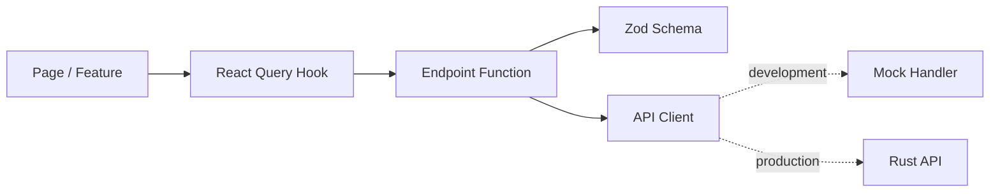

# 新疆大学 ICT&软开实验室主页开发计划

| 项目项 | 内容 |
| --- | --- |
| 站点 | 新疆大学 ICT&软开实验室主页 |
| 首期模块 | 项目库 `/projects` |
| 文档版本 | v1.1 |
| 制定日期 | 2026-07-22 |
| 前端基线 | React + TypeScript + pnpm + Vite |
| 后端基线 | Rust + Axum + SQLx |
| 首期数据库 | SQLite |
| 身份认证 | 复用 `xju-feiyue` 账号、JWT 与权限数据库 |
| Python 约束 | 仅在必要时使用，并统一由 uv 管理 |

## 1. 计划目标

本计划用于把开题阶段的产品方向转化为可执行的工程任务。首期只建设实验室主页下的项目库模块，同时保留全局站点壳和顶部导航槽位，不提前实现成员、研究方向、成果、加入我们等其他模块。

阶段交付、退出条件和评审门见 [里程碑](里程碑.md)。

首期最终应形成以下闭环：

1. 用户从 `/projects` 浏览项目名称、简介、类别和曾获奖；
2. 用户进入 `/projects/:slug` 查看负责人、状态、锐评、奖项和资源；
3. 有权限的成员可以创建、编辑和归档项目；
4. 可以维护 GitHub、百度网盘、ZIP、PPTX、PDF、DOC/DOCX 和视频等资源；
5. 可以预览并确认链接、附件和 Codex 整理结果；
6. Agent 可以只读检索项目并返回数据引用；
7. 系统可以在 4 核 8 GB Linux 服务器上部署和备份。
8. 实验室成员使用已有飞跃账号登录，由飞跃超级管理员维护成员标记。

## 2. 不可变技术约束

### 2.1 前端

- 使用 React 和 TypeScript；
- 使用 pnpm 管理依赖和执行脚本；
- 使用 Vite 作为开发服务器和生产构建工具；
- 使用 Vitest 进行单元/组件测试；
- 使用 Playwright 进行核心端到端测试；
- 可复用 `xju-feiyue` 的前端设计和基础工程配置时，应直接复制并在本项目中维护；
- 不使用 npm 或 yarn 生成第二套锁文件；
- 不在组件内直接调用 `fetch`，统一经过 API Client、Endpoint 和 Zod Schema。

### 2.2 后端

- 使用 Rust；
- Web 框架使用 Axum；
- 异步运行时使用 Tokio；
- 数据访问使用 SQLx；
- 首期数据库固定为 SQLite；
- 数据库迁移纳入仓库并由服务启动或部署命令执行；
- 不为首期功能拆分微服务或引入独立消息队列。

### 2.3 Python

- 默认不使用 Python；
- 仅当 Office 文件提取、历史数据清洗等任务在 Rust/TypeScript 中成本明显过高时使用 Python；
- 所有 Python 依赖由 uv 管理；
- 禁止在仓库中直接维护手工 `pip install` 流程；
- 禁止提交未被 `pyproject.toml` 或 uv 脚本元数据声明的 Python 依赖；
- CI 中只能通过 `uv sync`、`uv run` 或 `uvx` 执行 Python 工具。

### 2.4 认证与身份数据

- `xju-feiyue` 是账号、密码哈希、JWT、用户资料和登录审计的唯一身份源；
- ICTHub 不建立本地密码表、不签发独立登录令牌、不直接写飞跃 SQLite；
- 飞跃用户表新增 `is_lab_member`，且只能由飞跃超级管理员修改；
- ICTHub Rust 将 Bearer Token 转发至飞跃 `/auth/me` 校验，不共享 JWT 签名密钥；
- ICTHub 业务库只保存 `sid` 引用，不建立跨 SQLite 外键；
- 飞跃 `superadmin` 映射为 ICTHub 超级管理员；飞跃 `admin` 不自动获得 ICTHub 管理权限；
- 具体接口、迁移和服务器拓扑见 [认证与部署集成方案](认证与部署集成.md)。

## 3. `xju-feiyue` 复用策略

### 3.1 参考基线

首次复制以以下版本为基线：

```text
repository: XjuSelab/xju-feiyue
commit:     706eb373525dd7f92ea4032d38251378c3f04c6d
source:     frontend/
license:    MIT
```

复制后应在 `docs/前端复用记录.md` 或提交说明中记录：

- 原文件路径；
- 基线提交；
- 本项目修改内容；
- 后续是否继续跟随上游。

### 3.2 第一批直接复制文件

初始化前端时优先复制以下全局工程设置，再根据 ICTHub 业务裁剪：

```text
xju-feiyue/frontend/
├── .editorconfig
├── .prettierignore
├── .prettierrc
├── eslint.config.js
├── components.json
├── postcss.config.js
├── tailwind.config.ts
├── tsconfig.json
├── tsconfig.app.json
├── tsconfig.node.json
├── vite.config.ts
└── src/
    ├── styles/
    │   ├── tokens.css
    │   ├── globals.css
    │   └── prose-claude.css
    ├── lib/
    │   └── cn.ts
    ├── stores/
    │   └── authStore.ts
    ├── pages/
    │   └── LoginPage.tsx
    ├── features/auth/
    │   ├── LoginForm.tsx
    │   └── RequireAccess.tsx
    ├── api/
    │   ├── schemas/auth.ts
    │   └── endpoints/auth.ts
    ├── test/
    │   └── setup.ts
    └── components/ui/
```

说明：

- `tokens.css` 和 `globals.css` 直接作为初始单一色源；
- `prose-claude.css` 仅在项目详情需要长文或 Markdown 时启用；
- `components/ui/` 可先整体复制，后续删除未使用组件；
- `vite.config.ts` 保留 `@` 路径别名与 Vitest 配置；
- `tailwind.config.ts` 保留 Design Tokens 映射，但将业务类别色替换为项目类别；
- `package.json` 不直接照搬全部依赖，只复制当前模块确实需要的依赖与脚本；
- 登录页面、表单、`authStore`、User/Login Schema、认证 Endpoint 和受保护路由直接复用飞跃实现，并记录路径与基线提交；
- 不复制笔记、评论、点赞、编辑器、学校库和会议等业务代码。

### 3.3 建议保留的设计规则

- `Source Serif 4 / Noto Serif SC` 用于项目标题；
- `Inter Tight / PingFang SC` 用于界面与正文；
- 暖白背景、深灰正文、低对比度辅助文字；
- 6/8/12 px 圆角层级；
- 轻边框和极轻阴影；
- 项目类别只使用克制的单色文字或浅色标签；
- 页面主体使用较窄最大宽度与充分留白；
- 不使用大面积指标卡和常驻管理侧栏填充首页。

### 3.4 复用后的验证

完成复制后必须运行：

```bash
pnpm install
pnpm typecheck
pnpm lint
pnpm test --run
pnpm build
```

如果复制了 Playwright 基线，还需运行：

```bash
pnpm e2e
```

复制操作完成但上述命令未通过，不视为“已完成复用”。

## 4. 仓库结构计划

```text
xju-icthub/
├── frontend/
│   ├── package.json
│   ├── pnpm-lock.yaml
│   ├── vite.config.ts
│   ├── tailwind.config.ts
│   └── src/
│       ├── api/
│       ├── components/
│       ├── features/
│       ├── pages/
│       ├── routes/
│       ├── stores/
│       └── styles/
├── backend/
│   ├── Cargo.toml
│   ├── crates/
│   │   ├── server/
│   │   ├── application/
│   │   ├── domain/
│   │   ├── persistence/
│   │   ├── storage/
│   │   └── agent/
│   └── migrations/
├── tools/
│   └── python/              仅在确有需要时创建
├── data/
│   ├── .gitkeep
│   └── README.md            SQLite 与附件目录说明
├── deploy/
├── docs/
└── Makefile
```

运行数据、SQLite 数据库和用户上传文件不得提交到 Git。

## 5. 前端实施计划

### 5.1 工程初始化

1. 从 `xju-feiyue/frontend` 复制全局样式和工程配置；
2. 新建本项目 `package.json`，保留必要脚本；
3. 使用 pnpm 安装依赖并生成唯一的 `pnpm-lock.yaml`；
4. 建立 React Router 与 AppShell；
5. 建立空的 `GlobalNavSlot`；
6. 添加 `/`、`/projects`、`/projects/:slug` 和 `/admin/projects` 路由；
7. 为 `/` 提供极简占位，不将项目库直接挂到根路径。
8. 接入飞跃登录页面与账号入口，开发期通过 mock `/auth` 保持同一契约。

### 5.2 前端依赖建议

首期依赖控制在以下范围：

- `react`、`react-dom`；
- `react-router-dom`；
- `@tanstack/react-query`；
- `zod`；
- `zustand`；
- `lucide-react`；
- shadcn/ui 使用到的 Radix 组件；
- `react-hook-form` 与 `@hookform/resolvers`；
- 文件预览库按实际功能逐个增加。

不应在初始化时复制 CodeMirror、复杂拖拽、评论、Markdown 编辑器等暂未使用的依赖。

### 5.3 前端数据层

遵循 `xju-feiyue` 的单向依赖结构：



前端组件只消费经过 Zod 校验的数据。开发期 mock 与 Rust API 必须返回同一 Schema。

### 5.4 页面交付顺序

1. AppShell 与空全局导航槽；
2. `/projects` 编辑部列表；
3. 类别筛选和搜索；
4. `/projects/:slug` 项目详情；
5. 新建/编辑项目表单；
6. 资源和奖项维护；
7. 导入预览；
8. Agent 问答抽屉或独立区块；
9. `/admin/projects` 管理页面。

### 5.5 前端脚本基线

`frontend/package.json` 至少包含：

```json
{
  "scripts": {
    "dev": "vite",
    "build": "tsc -b && vite build",
    "preview": "vite preview",
    "typecheck": "tsc -b --noEmit",
    "lint": "eslint .",
    "format": "prettier --write .",
    "test": "vitest",
    "test:run": "vitest run",
    "e2e": "playwright test"
  }
}
```

## 6. Rust 与 SQLite 实施计划

### 6.1 后端工程初始化

1. 创建 Cargo Workspace；
2. 初始化 Axum Server；
3. 加入 `tracing`、统一错误响应和请求 ID；
4. 配置 SQLx SQLite；
5. 创建迁移目录和第一版 Schema；
6. 建立健康检查 `/api/health`；
7. 建立 OpenAPI 文档；
8. 添加后端测试数据库辅助工具。

### 6.2 SQLite 配置

首期连接示例：

```text
sqlite://data/icthub.db?mode=rwc
```

服务启动时应执行或检查以下配置：

```sql
PRAGMA foreign_keys = ON;
PRAGMA journal_mode = WAL;
PRAGMA synchronous = NORMAL;
PRAGMA busy_timeout = 5000;
```

约束：

- SQLite 文件放在 `data/` 或部署持久卷，不提交 Git；
- 数据库迁移由 SQLx 管理；
- 外键必须开启；
- 写操作保持短事务；
- 避免在请求中进行长时间文件解析后再占用写事务；
- 文本搜索首期使用 SQLite FTS5；
- JSON 元数据仅保存非核心、可变的资源属性；
- 核心字段仍使用明确列和约束。

### 6.3 数据库表实施顺序

1. `projects`；
2. `project_members`，以 `user_sid` 引用飞跃账号；
3. `resources`；
4. `awards`；
5. `tags` 与 `project_tags`；
6. `status_history`；
7. `import_jobs` 与 `import_items`；
8. `audit_logs`；
9. `agent_threads` 与 `agent_messages`。

ICTHub SQLite 不创建本地 `users` 或密码表。`created_by_sid`、`owner_sid`、`user_sid` 等字段保存飞跃学号字符串，写入前通过飞跃身份接口和 ICTHub 权限规则校验。

### 6.4 API 实施顺序

1. 健康检查；
2. 飞跃身份适配器、可选身份和成员权限 Guard；
3. 项目列表与详情；
4. 项目创建、编辑和归档；
5. 奖项 CRUD；
6. 资源 CRUD 和上传；
7. 状态历史；
8. 导入预览与确认；
9. Agent 只读查询。

### 6.5 后端质量命令

每次合并前执行：

```bash
cargo fmt --all --check
cargo clippy --workspace --all-targets --all-features -- -D warnings
cargo test --workspace
```

数据库相关测试使用临时 SQLite 文件或独立测试目录，测试结束后清理，不共享开发数据库。

## 7. Python 与 uv 使用规则

### 7.1 允许使用的场景

- 一次性历史 CSV/Excel 清洗；
- DOC/DOCX/PPTX/PDF 元数据或正文提取验证；
- 迁移前的数据质量报告；
- Rust 与 TypeScript 暂无成熟工具的离线处理。

### 7.2 不允许使用的场景

- 不使用 Python 承担在线 API；
- 不用 Python 绕过 Rust 领域逻辑直接修改生产 SQLite；
- 不因脚本方便而建立第二套业务模型；
- 不提交虚拟环境目录；
- 不使用全局 `pip install` 作为项目安装步骤。

### 7.3 uv 目录与命令

如果确实需要 Python，建立：

```text
tools/python/
├── pyproject.toml
├── uv.lock
├── README.md
└── src/
```

常用命令：

```bash
uv sync --frozen
uv run python -m pytest
uv run python -m <module>
uv add <package>
```

一次性工具优先考虑 `uvx <tool>`，但 CI 和可复现脚本应锁定版本。

## 8. 测试计划

### 8.1 前端测试

单元测试：

- 项目类别映射；
- 搜索参数；
- Zod Schema；
- 奖项展示规则；
- 文件类型识别；
- 导入预览转换。
- 飞跃 User/Login Schema 与权限映射；

组件测试：

- 项目列表加载、空状态和错误状态；
- 类别筛选；
- 项目表单校验；
- 资源行和奖项行；
- 全局导航槽为空时布局稳定。
- 登录表单、令牌恢复和成员管理入口可见性；

端到端测试：

- `/` 与 `/projects` 路由分离；
- 浏览、搜索和打开项目详情；
- 创建并编辑项目；
- 添加奖项与资源；
- 导入预览和确认；
- 未授权写操作被拒绝；
- 非实验室成员的有效飞跃账号仍被拒绝写入；
- Agent 回答包含项目引用。

### 8.2 后端测试

- 领域枚举与校验；
- SQLite 迁移；
- Repository CRUD；
- 唯一约束与外键；
- 项目列表筛选与分页；
- FTS5 搜索；
- 导入事务与冲突处理；
- 文件元数据校验；
- 权限矩阵；
- 飞跃 `/auth/me` 响应解析与失败关闭；
- `superadmin`、`is_lab_member` 和项目内角色映射；
- Agent 工具参数校验。

### 8.3 集成测试

- React Schema 与 OpenAPI 契约一致；
- 前端 mock 与 Rust 响应一致；
- ICTHub 与飞跃 `/auth/me` 契约一致；
- 测试使用 fake identity service，不读取生产飞跃数据库；
- 上传文件、数据库记录与下载权限一致；
- 数据库备份可以恢复；
- SQLite WAL 模式下的并发读取和短写入符合预期。

## 9. CI 计划

GitHub Actions 至少包含：

### Frontend Job

```bash
corepack enable
pnpm install --frozen-lockfile
pnpm typecheck
pnpm lint
pnpm test:run
pnpm build
```

### Backend Job

```bash
cargo fmt --all --check
cargo clippy --workspace --all-targets --all-features -- -D warnings
cargo test --workspace
```

### Python Job

仅在 `tools/python/` 存在时启用：

```bash
uv sync --frozen
uv run python -m pytest
```

### E2E Job

- 使用构建后的前端；
- 启动 Rust API；
- 使用临时 SQLite 数据库；
- 加载测试 fixture；
- 执行 Playwright；
- 失败时上传截图、视频和服务日志。

## 10. 本地开发命令目标

建议在根目录提供 Makefile 或任务脚本：

```bash
make setup        # 安装/检查工具并初始化依赖
make dev          # 并行启动前端与后端
make test         # 前后端单元测试
make check        # format/lint/typecheck/clippy
make e2e          # 完整端到端测试
make migrate      # 执行 SQLite 迁移
make seed         # 写入开发数据
make backup       # 备份 SQLite 与附件索引
```

Windows 环境可同时提供 PowerShell 脚本，但不得形成与 CI 不同的另一套行为。

## 11. huawei2 部署目标

- 通过持久 tmux 会话执行 `ssh huawei2`，部署目录计划为 `/home/winbeau/xju-icthub`；
- 保留飞跃现有 `127.0.0.1:8001` 身份服务，ICTHub Rust 计划监听 `127.0.0.1:8003`；
- `icthub.top/auth/*` 反向代理到飞跃，`/api/*` 反向代理到 ICTHub，其他路径提供 React SPA；
- ICTHub SQLite 与附件目录独立于飞跃数据库并分别备份；
- 首期沿用服务器现有 systemd + Nginx，不把容器化设为上线前置条件；
- 生产飞跃工作区存在现场运维文件，部署过程禁止 reset、clean 或覆盖；
- 需要 sudo 时暂停自动操作，由维护者在 tmux 中交互注入，任何脚本不得保存 sudo 密码。

## 12. 分支与提交规范

- 默认分支：`main`；
- 功能分支：`feat/<topic>`；
- 修复分支：`fix/<topic>`；
- 文档分支：`docs/<topic>`；
- 提交遵循 Conventional Commits；
- 每个 PR 只解决一个明确问题；
- PR 必须说明测试命令与结果；
- 复制 `xju-feiyue` 文件的 PR 必须列出来源文件和参考提交。

## 13. 计划完成判定

开发计划进入“可执行”状态需满足：

- 技术约束无冲突；
- 每个里程碑都有明确产物和退出条件；
- 前端复用文件清单已确定；
- SQLite 数据目录、迁移和备份策略已确定；
- Python/uv 规则已写入开发流程；
- CI 命令与本地命令一致；
- `/`、`/projects` 与全局导航槽的职责已冻结。
- 飞跃身份源、实验室成员标记、Rust 校验方式和 huawei2 部署边界已冻结。
