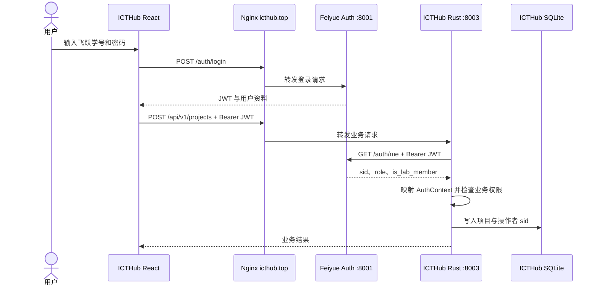

# ICTHub 与 xju-feiyue 认证及部署集成方案

| 项目项 | 内容 |
| --- | --- |
| 文档版本 | v1.0 |
| 制定日期 | 2026-07-22 |
| 身份源 | `xju-feiyue` |
| 业务服务 | `xju-icthub` Rust + Axum |
| 部署主机 | WSL SSH 别名 `huawei2` |
| 目标域名 | `icthub.top` |

## 1. 已确认决策

1. 实验室成员必定已有飞跃账号，ICTHub 不提供独立注册、密码重置或第二套账号体系。
2. `xju-feiyue` 是账号、密码哈希、JWT、个人资料、登录审计和实验室成员标记的唯一数据源。
3. ICTHub 前端直接复用飞跃的登录页面、表单、认证 Store、Zod Schema、API Endpoint 和受保护路由模式。
4. ICTHub Rust 后端不读取密码、不签发登录 JWT，也不持有飞跃 JWT 密钥；收到 Bearer Token 后通过飞跃认证接口确认当前用户。
5. 飞跃超级管理员负责标记哪些账号属于实验室成员；普通飞跃管理员不能修改该标记。
6. ICTHub 的项目、资源、奖项、导入和审计记录保存在独立 SQLite 中，只用学号 `sid` 引用飞跃账号。
7. 生产环境部署在 `huawei2`。涉及 systemd、Nginx、目录权限等 sudo 操作时，由维护者在持久 tmux 会话中交互授权，不传递或保存 sudo 密码。

## 2. 当前部署基线

对 `huawei2` 的只读检查确认：

- 飞跃仓库位于 `/home/winbeau/xju-feiyue`；
- `feiyue-backend.service` 使用 uv 启动 FastAPI/Uvicorn；
- 飞跃后端监听 `127.0.0.1:8001`；
- Nginx 已将 `/auth` 等飞跃 API 路径反向代理到 `8001`；
- 飞跃身份数据库为服务目录中的 SQLite，并由 Alembic 管理迁移；
- 当前账号包含 `user`、`admin`、`superadmin` 角色，但尚无实验室成员字段；
- 服务器还存在其他服务，因此 ICTHub Rust 后端计划监听 `127.0.0.1:8003`，部署时再次检查端口占用。

生产飞跃工作区存在本地变更和未跟踪运维文件。ICTHub 部署不得清理、重置或覆盖该目录；飞跃身份字段变更必须在飞跃仓库中通过正式迁移提交并单独部署。

## 3. 数据所有权

| 数据 | 唯一写入方 | 存储位置 | ICTHub 使用方式 |
| --- | --- | --- | --- |
| 学号、姓名、头像、联系方式 | 飞跃 | 飞跃 SQLite | 通过认证/身份 API 读取 |
| 密码哈希 | 飞跃 | 飞跃 SQLite | ICTHub 永不读取 |
| JWT 签发与登录审计 | 飞跃 | 飞跃服务与 SQLite | ICTHub 只提交 Bearer Token 校验 |
| `role` | 飞跃超级管理员 | 飞跃 SQLite | `superadmin` 映射为 ICTHub 超级管理员 |
| `is_lab_member` | 飞跃超级管理员 | 飞跃 SQLite | 映射为 ICTHub 实验室成员 |
| 项目与项目成员关系 | ICTHub Rust | ICTHub SQLite | 使用 `sid` 字符串引用账号 |
| 资源、奖项、导入、Agent 记录 | ICTHub Rust | ICTHub SQLite | 按 ICTHub 领域规则维护 |
| ICTHub 操作审计 | ICTHub Rust | ICTHub SQLite | 记录操作者 `sid` 与变更摘要 |

禁止的实现方式：

- ICTHub 建立本地密码表或复制飞跃用户数据；
- Rust 直接写入飞跃 SQLite；
- ICTHub 与飞跃共享 JWT 签名密钥；
- 用跨 SQLite 外键连接两个数据库；
- 根据飞跃 `admin` 角色自动授予 ICTHub 管理权限。

飞跃 `admin` 角色属于飞跃自身业务权限。只有 `is_lab_member=true` 或 `role=superadmin` 才获得 ICTHub 内部身份。

## 4. 认证流程



首期验证策略：

- 公开列表和公开详情无需登录；
- 受保护请求由 Rust 调用飞跃 `GET /auth/me` 校验；
- 可增加约 30 秒的进程内短缓存降低本机回环请求，但权限修改后必须很快生效；
- 飞跃认证服务不可用时，公开读取可以继续，所有受保护操作失败关闭；
- Rust 到飞跃只走 `127.0.0.1`，不经过公网；
- 日志不得记录密码、完整 JWT 或飞跃密钥。

当前飞跃前端将令牌保存在浏览器本地存储中，而 `winbeau.top` 与 `icthub.top` 属于不同站点，因此首期是“同一账号和认证实现”，不是两个域名之间自动共享登录态。用户首次进入 ICTHub 时仍需使用飞跃账号登录。若未来需要真正单点登录，应单独设计中心认证域、授权码跳转和安全 Cookie，不在首期通过复制 localStorage 或扩大 Cookie Domain 实现。

## 5. 实验室成员标记

### 5.1 飞跃数据库迁移

在 `xju-feiyue` 中使用现有 uv + Alembic 流程新增：

```text
users.is_lab_member BOOLEAN NOT NULL DEFAULT false
```

同步修改：

- 后端 User ORM 模型；
- `/auth/me` 和管理员用户列表的输出 Schema；
- 前端 User Zod Schema，字段命名为 `isLabMember`；
- 超级管理员用户管理页面；
- 超级管理员专用的成员标记更新接口；
- 权限测试、迁移测试和回滚说明。

迁移默认值必须为 `false`，上线后由超级管理员逐个或批量确认实验室成员，不能按飞跃管理员角色自动推断。

### 5.2 权限映射

| 身份 | 条件 | ICTHub 权限 |
| --- | --- | --- |
| 访客 | 无有效飞跃登录 | 查看公开项目和公开资源 |
| 飞跃用户 | 有效账号，但非实验室成员 | 已登录访问，不能调用项目写接口 |
| 实验室成员 | `is_lab_member=true` | 创建项目；按项目关系编辑内容和资源 |
| 项目负责人/维护者 | 实验室成员，且 ICTHub `project_members` 中有对应角色 | 管理指定项目、成员、状态和资源 |
| ICTHub 超级管理员 | 飞跃 `role=superadmin` | 全局数据、导入、权限、审计和成员管理入口 |

`project_members` 保存 `user_sid` 和项目内角色，不保存密码、用户快照或跨库外键。项目创建者、资源上传者和审计操作者也统一保存 `sid`。

## 6. 前端复用范围

从已记录的飞跃基线复制并按 ICTHub 路由裁剪：

- `LoginPage` 与 `LoginForm`；
- `authStore` 的令牌恢复、`/auth/me` 刷新和登出逻辑；
- User/Login Zod Schema；
- auth Endpoint 与 API Client 的 Bearer Token 注入；
- `RequireAccess` 或等价受保护路由；
- AppShell 中的账号入口、头像菜单和品牌区块；
- 表单校验、错误反馈和登录页样式。

保留飞跃现有登录协议和 localStorage key 时，应在代码中记录来源；如果为避免两个站点状态混淆而调整 key，只改存储命名，不修改服务端协议。

## 7. Rust 认证适配器

Rust 后端建立独立的 `auth` 模块，至少包含：

```text
AuthContext {
  sid,
  role,
  is_lab_member,
  display_name,
}
```

建议接口边界：

- `FeiyueIdentityClient`：向 `http://127.0.0.1:8001/auth/me` 转发 Bearer Token；
- `OptionalAuth`：公开读取可选解析身份；
- `RequireLogin`：要求有效飞跃账号；
- `RequireLabMember`：要求实验室成员或超级管理员；
- `RequireProjectRole`：结合 ICTHub `project_members` 校验项目内权限；
- `RequireSuperadmin`：只接受飞跃 `superadmin`。

开发和测试中使用 mock identity server 或 trait fake，不连接生产飞跃数据库。API 契约测试应固定 `/auth/me` 必需字段，防止飞跃响应变更导致 ICTHub 静默放权。

## 8. huawei2 部署拓扑

```text
Internet
   │
   ▼
Nginx :443  icthub.top
   ├── /auth/*  ─────→ Feiyue FastAPI 127.0.0.1:8001
   ├── /api/*   ─────→ ICTHub Axum    127.0.0.1:8003
   └── /*       ─────→ /home/winbeau/xju-icthub/frontend/dist

Feiyue FastAPI ──────→ /home/winbeau/xju-feiyue/backend/labnotes.db
ICTHub Axum ─────────→ /home/winbeau/xju-icthub/backend/data/icthub.db
                    └→ 独立附件目录
```

计划新增：

- 仓库目录 `/home/winbeau/xju-icthub`；
- `icthub-backend.service`，以非 root 用户运行；
- `WorkingDirectory=/home/winbeau/xju-icthub/backend`；
- Rust 服务监听 `127.0.0.1:8003`；
- Nginx 的 `icthub.top` 站点与 SPA fallback；
- ICTHub SQLite、附件和日志的独立备份策略。

首期优先沿用服务器现有的 systemd + Nginx 运维方式，不强制引入 Docker Compose。若之后统一容器化，认证服务的网络边界和两个数据库的所有权仍保持不变。

## 9. 部署步骤与 sudo 边界

1. 本地完成代码、迁移、测试并推送 GitHub；
2. 通过持久 tmux 会话执行 `ssh huawei2`；
3. 检查飞跃工作区状态、服务状态、端口和备份，不覆盖现场文件；
4. 在独立 ICTHub 目录 clone/pull，并构建前端和 Rust release；
5. 先在非特权端口手工运行健康检查；
6. 需要安装 systemd unit、修改 Nginx 或目录权限时暂停，由维护者在 tmux 中交互执行 sudo；
7. 执行配置检查、服务重载和 HTTPS 验证；
8. 运行登录、成员权限、项目 CRUD 和备份恢复冒烟测试；
9. 记录部署提交、迁移版本和回滚点。

任何自动化脚本都不得接收、回显或写入 sudo 密码。

## 10. 验收清单

- 飞跃账号可在 `icthub.top` 登录，错误密码不会进入 ICTHub；
- `/auth/me` 返回 `sid`、`role`、`is_lab_member`；
- 非实验室成员的有效飞跃账号无法创建或修改项目；
- 实验室成员可以创建项目，并只能按项目关系修改项目；
- 飞跃超级管理员拥有 ICTHub 全局管理权限；
- 只有飞跃超级管理员能修改 `is_lab_member`；
- Rust 不读取飞跃 SQLite，不持有飞跃 JWT 密钥；
- ICTHub SQLite 不存在密码列或本地账号表；
- 飞跃认证中断时，公开项目仍可读取，受保护写操作返回明确错误；
- `icthub.top/auth/*`、`/api/*` 和 SPA fallback 路由互不冲突；
- 两个 SQLite 和附件可以分别备份、恢复；
- 部署过程未修改或清理飞跃生产工作区中的现场文件。
