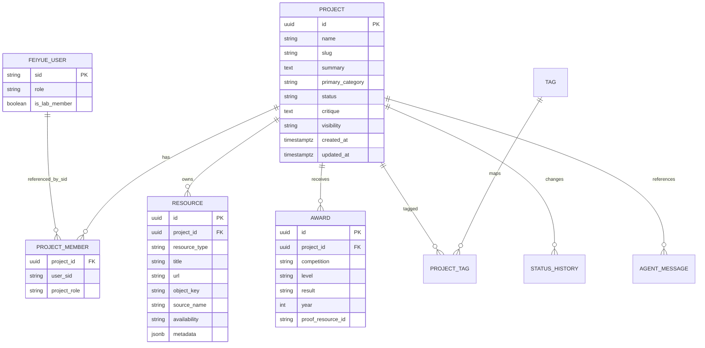
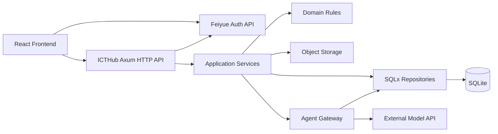

# 新疆大学 ICT&软开实验室主页——项目库模块开题文档

| 项目项 | 内容 |
| --- | --- |
| 站点名称 | 新疆大学 ICT&软开实验室主页 |
| 首期模块 | ICTHub 项目资源库与项目知识管理模块 |
| GitHub 仓库 | `winbeau/xju-icthub` |
| 目标域名 | `icthub.top` |
| 模块路径 | `/projects`（暂定） |
| 文档版本 | v0.4 |
| 编写日期 | 2026-07-22 |
| 当前阶段 | 开题、需求边界与技术选型 |

## 1. 项目背景

`xju-icthub` 的整体定位是新疆大学 ICT&软开实验室主页，而不是单一项目管理网站。站点未来可以承载实验室介绍、成员、研究方向、成果和加入我们等内容。本期开题聚焦其中第一个业务模块：项目库。

实验室项目资料通常分散在成员电脑、百度网盘、GitHub 仓库、聊天记录和历届交接压缩包中。项目名称、技术方向、获奖记录、当前负责人和可运行版本之间缺少稳定关联，导致以下问题：

1. 新成员不知道实验室做过哪些项目，也难以判断某个项目是否值得继续维护或参赛。
2. 同一项目的代码、答辩 PPT、说明文档、演示视频和压缩包分散存放，链接容易失效。
3. 项目交接依赖个人记忆，来源者、当前负责人和迁移状态不清楚。
4. 项目类别、技术标签和研发状态经常混为一谈，搜索与统计困难。
5. 历届获奖项目缺少结构化记录，无法快速形成实验室成果展示。

项目库的目标不是重新实现 Jira，而是建立一套适合实验室长期维护的“项目档案库 + 资源索引 + 轻量管理工作台”，并作为实验室主页下的独立模块运行。

## 2. 项目定位

站点采用“全局主页壳 + 独立业务模块”的结构：

- 根路径 `/` 属于实验室主页，首期允许为简洁占位页；
- 项目库暂定放在 `/projects`；
- 项目详情放在 `/projects/:slug`；
- 项目管理入口放在 `/admin/projects`；
- 全局顶部导航预留空间，后续再加入成员、研究、成果、加入我们等入口。

项目库同时服务三类需求：

- **项目发现**：快速理解“这是什么项目、属于什么类别、曾获得什么奖”。
- **项目交接**：找到负责人、代码、文档、演示、可运行版本和迁移记录。
- **知识复用**：利用搜索与 Agent 问答发现可继续参赛、改造为工具或扩展为论文的项目。

项目库列表页只展示四项高价值信息：

1. 项目主类别；
2. 项目名称；
3. 两行内容简介；
4. 曾获奖。

负责人、研发状态、资源列表、技术标签与锐评在进入详情后展示，避免项目库列表页成为字段堆叠的管理看板。

## 3. 建设目标与非目标

### 3.1 建设目标

- 建立统一、可搜索的项目档案。
- 支持项目及其资源的基础增删改查。
- 支持链接与附件混合提交的 Codex 一键整理导入。
- 区分项目主类别、技术标签和研发状态。
- 支持公开展示与内部管理两种访问视图。
- 保留 Agent 问答接口，回答项目检索、资源缺失、交接风险和复用建议等问题。
- 在 4 核 8 GB 服务器上稳定运行，避免引入不必要的重型基础设施。
- 预留实验室主页的全局 Header、导航槽位和模块路由，不将项目库组件绑定到根路径。

### 3.2 首期非目标

- 不实现完整的敏捷项目管理、工时、燃尽图和复杂任务依赖。
- 不在服务器本地部署大型语言模型。
- 不自动下载或破解百度网盘资源，只保存链接、提取码和可用性状态。
- 不在首期实现 Office 文件的在线协同编辑。
- 不允许 Agent 未经确认直接修改或删除项目数据。
- 不在本期完成实验室成员、研究方向、招生介绍等其他主页模块。

## 4. 用户与核心场景

| 用户 | 主要需求 |
| --- | --- |
| 访客/新成员 | 浏览实验室项目，按互联网+、计算机设计大赛、论文、工具项目筛选 |
| 项目成员 | 查找代码、文档、网盘、视频和交接说明 |
| 当前负责人 | 更新项目状态、补充资源、维护可运行版本 |
| 实验室管理员 | 管理 Codex 导入任务、合并重复项目、管理权限、检查失效资源 |
| 指导教师 | 查看项目成果、获奖情况与当前维护状态 |

典型任务：

1. 搜索一个历届项目并找到最后可运行的代码版本。
2. 筛选所有计算机设计大赛项目，判断哪些项目适合继续参赛。
3. 查看某个项目曾获奖、当前负责人和已有演示材料。
4. 一次粘贴 GitHub、百度网盘和文件名称，创建项目资源草稿。
5. 向 Agent 询问“哪些工具项目可以继续扩展成论文”。

## 5. 信息架构

### 5.1 项目主类别

主类别是项目库列表页最重要的分类字段，每个项目首期只选择一个：

- 互联网+
- 计算机设计大赛
- 论文
- 工具项目
- 其他

主类别表示项目的主要定位，不用于表达软件/硬件、AI/传统等技术属性。

### 5.2 技术标签

技术标签允许多选，用于横向检索：

- 形态：软件、硬件、软硬结合；
- 技术：AI、传统算法、Web、嵌入式、机器人、数据分析等；
- 用途：比赛、科研、教学、内部管理、公共服务等。

### 5.3 项目状态

状态用于管理当前工作阶段，不应占据公开项目库列表页的主要视觉位置：

- 构思中；
- 研发中；
- 运维测试；
- 迁移中；
- 暂停维护；
- 已归档。

### 5.4 核心实体



### 5.5 资源类型

首期统一支持以下资源：

- 百度网盘链接与提取码；
- GitHub 仓库链接；
- ZIP 或其他压缩包；
- PPT/PPTX；
- PDF；
- DOC/DOCX；
- 展示视频；
- 普通网页链接；
- 其他附件。

资源作为项目的子实体保存，而不是为每一种文件类型在项目表中增加固定列。

## 6. 功能范围

### 6.1 MVP 必须完成

1. `/projects` 项目列表与编辑部式模块首页；
2. 按主类别筛选和关键词搜索；
3. 项目详情；
4. 项目创建、编辑、归档和删除；
5. 资源创建、上传、外链和删除；
6. 曾获奖的结构化维护与项目列表单行展示；
7. 来源者、当前负责人和项目成员维护；
8. 状态修改与状态变更历史；
9. 链接与附件混合提交；
10. Codex 分析、资源分类与导入预览；
11. 基础角色权限和审计日志；
12. Agent 只读问答入口。

### 6.2 第二阶段候选功能

- GitHub 仓库元数据定时同步；
- 百度网盘链接可用性人工确认；
- PDF、图片和常见 Office 文件预览；
- 项目之间的派生、复用和关联关系；
- 项目交接清单和缺失资源检查；
- 面向公开页面的精选项目与成果专题。

## 7. 前端方案

### 7.1 默认界面方向

默认采用 `docs/prototypes/02-editorial-list.html` 的编辑部列表结构：

- 顶部仅保留品牌、项目/成果导航和新建项目入口；
- 页面标题与搜索区保持宽松留白；
- 类别使用文本标签页，不使用大量统计卡片；
- 项目按“类别 / 名称与简介 / 进入箭头”排列；
- “曾获奖”作为简介后的弱化信息行；
- 详情展开后再展示锐评、资源和管理字段。

该原型表示 `/projects` 模块内容区，不代表整个实验室站点的根首页，也不负责定义未来的全局导航内容。

### 7.2 全局站点壳与路由预留

前端从第一天就建立全局 `AppShell`，但首期保持全局导航克制：

```text
AppShell
├── GlobalHeader
│   ├── Brand：ICT&软开实验室
│   ├── GlobalNavSlot：预留，首期为空或仅有“项目”
│   └── AccountSlot：登录/管理入口
├── RouteOutlet
└── Footer
```

路由暂定如下：

| 路径 | 首期行为 | 后续方向 |
| --- | --- | --- |
| `/` | 实验室主页占位或极简介绍 | 实验室介绍、动态与精选内容 |
| `/projects` | 项目库列表，本期主要页面 | 保持稳定 |
| `/projects/:slug` | 项目详情 | 保持稳定 |
| `/admin/projects` | 项目管理 | 可扩展为完整后台 |
| `/members` | 暂不实现 | 实验室成员 |
| `/research` | 暂不实现 | 研究方向 |
| `/achievements` | 暂不实现 | 论文、竞赛与其他成果 |
| `/join` | 暂不实现 | 加入实验室 |

实现约束：

- 项目页不自行渲染实验室全局导航，只消费 `AppShell` 提供的槽位；
- 全局导航数据集中配置，不能散落在各业务页面；
- 项目模块内部只保留类别筛选、搜索和新建等局部操作；
- 即使首期 `GlobalNavSlot` 为空，也必须保留其布局与组件接口；
- 后续增加导航时，不移动 `/projects` 路径，不重写项目页面主体。

### 7.3 对 `xju-feiyue` 的设计参考

本项目复用 `XjuSelab/xju-feiyue` 的前端设计体系与登录模块；笔记、评论等无关业务代码不复制：

- Notion 风格的克制页面壳与浅边框；
- `Source Serif 4 / Noto Serif SC` 用于标题，`Inter Tight / PingFang SC` 用于界面；
- 暖白背景、深灰正文、低对比度辅助文字；
- 6/8/12 px 圆角体系与极轻卡片阴影；
- CSS Design Tokens 作为颜色、字体、圆角和阴影的单一来源；
- React 组件、业务功能、API 层和 Zod Schema 分层；
- TanStack Query 管理远端状态，组件不直接调用 `fetch`；
- 开发期提供 mock 数据，连接 Rust 后端时不修改页面组件。

应避免照搬的部分：

- 复杂的项目列表多分区；
- 与项目管理无关的笔记编辑器、评论和点赞模块；
- 大量常驻侧栏、统计卡片和状态徽章；
- 为分类使用过多颜色。

### 7.4 前端技术栈

- React + TypeScript；
- pnpm，作为唯一前端包管理器；
- Vite，负责开发服务器和生产构建；
- React Router；
- Tailwind CSS；
- shadcn/ui + Radix UI；
- TanStack Query；
- Zod；
- Zustand，仅保存认证与少量 UI 状态；
- Lucide Icons；
- Vitest + React Testing Library + Playwright。

前端工程优先直接复制 `xju-feiyue/frontend` 的 `tokens.css`、`globals.css`、Tailwind、Vite、TypeScript、ESLint、Prettier、shadcn 和基础 UI 组件配置，再按本项目依赖范围裁剪。详细执行清单见 [开发计划](开发计划.md)。

### 7.5 前端目录建议

```text
frontend/src/
├── api/
│   ├── schemas/
│   ├── endpoints/
│   ├── mock/
│   └── client.ts
├── components/
│   ├── ui/
│   ├── layout/
│   └── common/
├── features/
│   ├── projects/
│   ├── resources/
│   ├── imports/
│   ├── awards/
│   └── agent/
├── pages/
├── stores/
└── styles/
    ├── tokens.css
    └── globals.css
```

其中 `components/layout/` 至少包含 `AppShell`、`GlobalHeader`、`GlobalNavSlot` 和 `Footer`，业务页面不得绕过站点壳直接挂载到根节点。

## 8. Rust 后端方案

### 8.1 技术选型

| 领域 | 建议 |
| --- | --- |
| Web 框架 | Axum |
| 异步运行时 | Tokio |
| 数据库 | SQLite，首期使用单机持久化文件 |
| 数据访问 | SQLx SQLite，使用显式 SQL 与迁移 |
| 序列化 | Serde |
| 参数校验 | Validator 或自定义领域校验 |
| API 文档 | Utoipa / OpenAPI |
| 中间件 | Tower / tower-http |
| 日志与追踪 | tracing + tracing-subscriber |
| 错误处理 | thiserror + 统一 API Error |
| 身份认证 | 复用 `xju-feiyue` 登录、JWT、账号数据库与登录审计 |
| 后台任务 | Tokio Task + 数据库任务表，首期不部署独立消息队列 |

### 8.2 服务分层



建议保留 ICTHub 单体应用，不在首期拆分业务微服务。项目、资源、导入和 Agent Gateway 放在同一个 Rust Workspace 中按 crate 或 module 分层；账号、密码与 JWT 继续由既有飞跃服务负责，Rust 仅实现身份适配器和业务权限 Guard。

### 8.3 后端目录建议

```text
backend/
├── Cargo.toml
├── crates/
│   ├── server/        Axum 路由、启动与中间件
│   ├── application/   用例服务
│   ├── domain/        实体、枚举与领域校验
│   ├── persistence/   SQLx 与迁移
│   ├── storage/       本地/S3 文件存储抽象
│   └── agent/         模型供应商、检索与回答引用
└── migrations/
```

### 8.4 SQLite 运行约束

- 数据库文件放在 `data/` 或部署持久卷，不提交 Git；
- 开启 `foreign_keys`、WAL、`busy_timeout` 和合理的同步模式；
- 写操作使用短事务，文件解析不占用数据库写事务；
- 搜索首期使用 SQLite FTS5；
- 测试使用临时 SQLite 文件，不共享开发数据库；
- 保持 Repository 边界，未来如需迁移数据库，不要求页面和领域层重写。

### 8.5 Python 与 uv 约束

默认不使用 Python。只有历史 Excel/Office 数据清洗或离线文本提取确实需要 Python 时，才建立 `tools/python/`，并使用 `pyproject.toml`、`uv.lock`、`uv sync` 和 `uv run` 管理。Python 工具不得直接绕过 Rust 服务修改生产 SQLite。

## 9. API 初步设计

```text
GET    /api/v1/projects
POST   /api/v1/projects
GET    /api/v1/projects/{id}
PATCH  /api/v1/projects/{id}
DELETE /api/v1/projects/{id}

GET    /api/v1/projects/{id}/resources
POST   /api/v1/projects/{id}/resources
DELETE /api/v1/resources/{id}

GET    /api/v1/projects/{id}/awards
POST   /api/v1/projects/{id}/awards
PATCH  /api/v1/awards/{id}

POST   /api/v1/imports/preview
POST   /api/v1/imports/commit
GET    /api/v1/imports/{id}

POST   /api/v1/agent/query
POST   /api/v1/agent/projects/{id}/summary
```

列表接口至少支持：

- `q`：搜索项目名、简介、奖项和标签；
- `category`：主类别；
- `status`：当前状态；
- `tag`：技术标签；
- `owner`：当前负责人；
- `visibility`：公开/内部；
- `page` 与 `page_size`：分页。

## 10. Codex 一键导入设计

### 10.1 混合材料收集

用户填写简介提示，可一次提交多个链接和附件，后端生成导入预览：

```text
https://github.com/example/project
百度网盘：https://pan.baidu.com/s/example 提取码 9abc
答辩材料 final.pptx
演示视频 demo.mp4
```

解析器识别 GitHub、百度网盘、普通 URL 和文件类型，由 Codex 生成结构化资源草稿。用户确认后才提交为正式项目。

### 10.2 文件上传

- 前端使用分片或流式上传接口，首期可限制单文件大小；
- 服务端根据扩展名、MIME 和文件头三方校验类型；
- 文件名不直接作为磁盘路径；
- 存储接口同时支持本地文件系统与 S3 兼容对象存储；
- 下载使用授权接口或短期签名地址。

## 11. Agent 问答接口

### 11.1 首期能力

- 按类别、简介、奖项、标签和负责人查找项目；
- 汇总一个项目的资源、锐评和最近状态；
- 找出缺少负责人、缺少演示视频或链接待确认的项目；
- 提供项目复用建议，例如“哪些工具项目适合扩展为论文”；
- 回答中返回项目和资源引用，用户可以直接进入详情。

### 11.2 安全边界

- Agent 首期只读；
- 不允许模型自行拼接并执行 SQL；
- 使用后端定义的检索工具和参数 Schema；
- 涉及创建、修改或删除时，只生成变更草稿并要求人工确认；
- 不向模型发送无关私有文件全文；
- 记录模型供应商、请求类型、引用对象和耗时，不记录敏感密钥。

### 11.3 资源约束

4 核 8 GB 服务器不适合常驻大型本地模型。首期使用外部模型 API，服务器负责权限、检索、上下文裁剪和结果引用。以后可根据使用量增加轻量嵌入服务，但不作为 MVP 前置条件。

## 12. 权限与安全

### 12.1 角色

- 访客：查看公开项目和公开资源；
- 飞跃普通用户：可以登录，但不是实验室成员时不能调用项目写接口；
- 实验室成员：飞跃账号 `is_lab_member=true`，可以创建项目并编辑自己参与的项目；
- 负责人：实验室成员，且在 ICTHub 项目成员关系中负责管理成员、状态和资源；
- 超级管理员：飞跃 `superadmin`，管理全局数据、导入、权限、审计，并标记实验室成员。

实验室成员必定已有飞跃账号。ICTHub 不建立本地用户或密码表，只在业务表中保存飞跃学号 `sid`。飞跃普通 `admin` 不自动映射为 ICTHub 管理员。

### 12.2 安全要求

- 所有写接口进行权限校验；
- 前端复用飞跃登录和 Bearer Token 协议，Rust 通过飞跃 `/auth/me` 校验，不持有飞跃 JWT 密钥；
- `winbeau.top` 与 `icthub.top` 首期不共享浏览器 localStorage，用户使用同一飞跃账号分别登录；
- 上传文件限制类型、大小与数量；
- 外链只保存，不由服务器主动请求任意地址，避免 SSRF；
- 项目删除首期采用软删除；
- 关键操作记录操作者、时间、对象和变更摘要；
- 数据库每日备份，附件目录采用独立备份策略；
- 密钥通过环境变量或部署 Secret 管理，不进入 Git。

完整的数据所有权、成员字段迁移、权限矩阵和降级策略见 [认证与部署集成方案](认证与部署集成.md)。

## 13. 部署方案

首期部署在 `huawei2`，沿用现有 systemd + Nginx 运维方式：

```text
Internet
   │
   ▼
Nginx :443  icthub.top
   ├── /          → React 单页应用与实验室主页
   ├── /projects  → React Router 项目库模块
   ├── /auth/     → Feiyue FastAPI 127.0.0.1:8001
   ├── /api/      → ICTHub Axum 127.0.0.1:8003
   └── /files/    → 受控文件下载

Feiyue Auth ── Feiyue Identity SQLite
ICTHub Rust ── ICTHub Business SQLite
        │
        └────── Local Object Directory / MinIO
```

部署原则：

- React 构建产物由反向代理直接提供；
- 根路径与 `/projects` 由同一 React AppShell 承载，服务器配置 SPA fallback；
- ICTHub Rust API 以 systemd 单实例起步，设置合理连接池；
- 飞跃和 ICTHub 分别拥有自己的 SQLite，禁止跨库写入和跨库外键；
- SQLite 文件与附件存储使用持久卷；
- 首期不部署 Kubernetes、Elasticsearch、Kafka 和独立向量数据库；
- 搜索先使用 SQLite FTS5；
- `icthub.top` 启用 HTTPS、HSTS 和自动证书更新；
- GitHub Actions 执行前后端测试与构建，部署需人工批准；
- 通过持久 tmux 会话执行 `ssh huawei2`；需要 sudo 时由维护者交互操作，不保存 sudo 密码；
- 飞跃生产工作区存在现场文件，部署不得 reset、clean 或覆盖。

## 14. 开发阶段计划

详细工作项、退出条件和评审门见 [里程碑](里程碑.md)，工程约束见 [开发计划](开发计划.md)。

| 阶段 | 时间建议 | 交付物 |
| --- | --- | --- |
| P0 开题与规范 | 第 1 周 | 开题文档、原型、数据模型、API 草案、仓库规范 |
| P1 前后端与认证骨架 | 第 2 周 | React AppShell、飞跃登录复用、`/projects`、Design Tokens、Axum 身份适配器、数据库迁移、CI |
| P2 项目与奖项 | 第 3 周 | 飞跃 `/auth/me` 联调、项目 CRUD、类别筛选、搜索、项目详情、曾获奖维护 |
| P3 资源与导入 | 第 4 周 | 资源 CRUD、分片上传、混合链接与附件导入、Codex 预览 |
| P4 权限与 Agent | 第 5 周 | 实验室成员标记、项目级权限、审计、只读 Agent 问答 |
| P5 验收与部署 | 第 6 周 | 自动化测试、双库备份恢复、性能检查、huawei2 与 icthub.top 部署 |

## 15. MVP 验收标准

### 15.1 功能验收

- 可以创建、编辑、搜索、筛选和归档项目；
- `/projects` 稳定展示项目类别、名称、简介和曾获奖；
- `/` 与 `/projects` 路由职责分离，全局导航槽为空时不影响布局；
- 项目详情可以维护负责人、状态、锐评、标签、奖项和资源；
- 可以提交 GitHub、百度网盘等链接和多种附件；
- 可以预览 Codex 整理结果并经人工确认后提交；
- 权限不足的用户无法调用写接口；
- 非实验室成员的飞跃账号无法写入，实验室成员和超级管理员权限符合矩阵；
- Agent 能回答至少五类预设问题并返回项目引用。

### 15.2 质量验收

- 前端通过 TypeScript、ESLint、单元测试和核心 Playwright 用例；
- Rust 通过 `cargo fmt`、`cargo clippy` 和核心服务测试；
- 数据库迁移可以在空库重复执行；
- 关键写操作具有审计记录；
- 备份文件可在测试环境恢复；
- 在 4 核 8 GB 服务器上，常规列表和详情请求目标 P95 小于 500 ms，不包含外部模型耗时。

## 16. 主要风险与控制

| 风险 | 控制措施 |
| --- | --- |
| 历史数据质量差 | 导入预览、冲突标记、人工确认，不盲目自动合并 |
| 网盘链接失效 | 保存最后确认时间和可用性状态，支持定期人工复核 |
| 文件存储增长 | 文件大小限制、对象存储抽象、备份与容量告警 |
| 项目列表再次变复杂 | 固定列表四项信息，新增字段默认进入详情 |
| 项目库被误当作整个站点首页 | 固定 `/projects` 模块路径，使用统一 AppShell 与全局导航槽 |
| Agent 产生错误结论 | 返回引用、首期只读、写操作必须人工确认 |
| 4C8G 资源不足 | 单体架构、SQLite FTS5、外部模型 API、避免重型中间件 |
| 权限边界不清 | 公开/内部双层可见性，资源级继承项目权限 |
| 两套账号数据漂移 | 飞跃作为唯一身份源，ICTHub 仅保存 `sid` 引用 |
| 飞跃认证不可用 | 公开读取继续，受保护写操作失败关闭并返回明确错误 |

## 17. 待确认事项

正式编码前需确定：

1. `icthub.top/` 首期展示极简实验室介绍，还是仅提供进入项目库的占位页；
2. 百度网盘首期只记录链接，还是需要人工确认可用性流程；
3. 上传文件首期容量和单文件大小限制；
4. 项目主类别是否允许管理员自定义；
5. “曾获奖”是否只记录最高奖项，还是首页显示最高奖、详情记录全部奖项；
6. Agent 使用的模型供应商与预算；
7. 是否需要把 `xju-feiyue` 的 Design Tokens 抽成共享包，还是在本项目独立维护；
8. 项目库正式路径是否确定为 `/projects`，以及全局导航首期是否完全留空。

## 18. 开题结论

新疆大学 ICT&软开实验室主页采用可扩展的站点壳，项目库是首期独立模块。项目库的核心价值是把分散的项目文件转化为可理解、可交接、可继续利用的项目资产。首期应坚持简约项目列表、结构化档案、Codex 一键导入和轻量 Rust 单体架构，同时为未来全局导航和其他实验室模块保留稳定扩展点。

开题阶段建议立即推进：

1. 确认待确认事项中的公开范围与存储限制；
2. 按 `xju-feiyue` 的 Design Tokens、登录系统与组件分层初始化 React AppShell、空全局导航槽和 `/projects` 模块；
3. 初始化 Rust Workspace、飞跃身份适配器、Axum、SQLx SQLite 与首批数据库迁移；
4. 先完成项目、奖项和资源三个核心实体的端到端闭环；
5. 以 `docs/prototypes/02-editorial-list.html` 作为第一轮前端验收基准。
